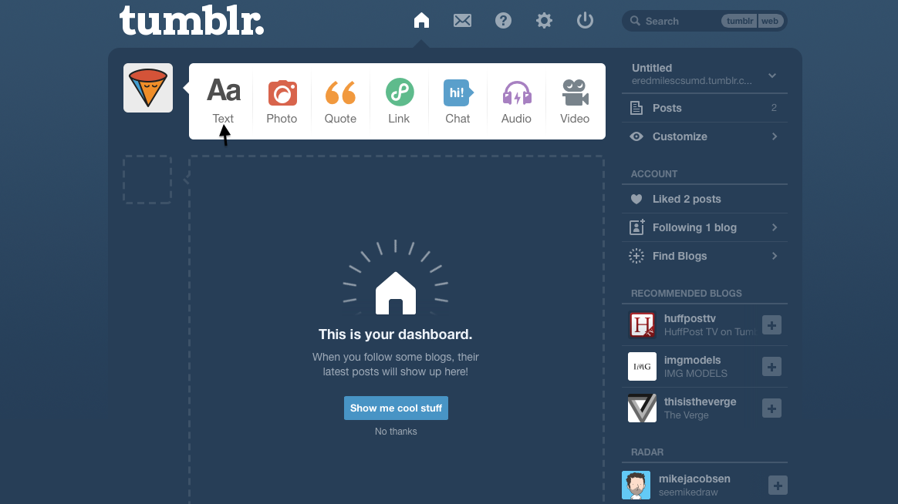
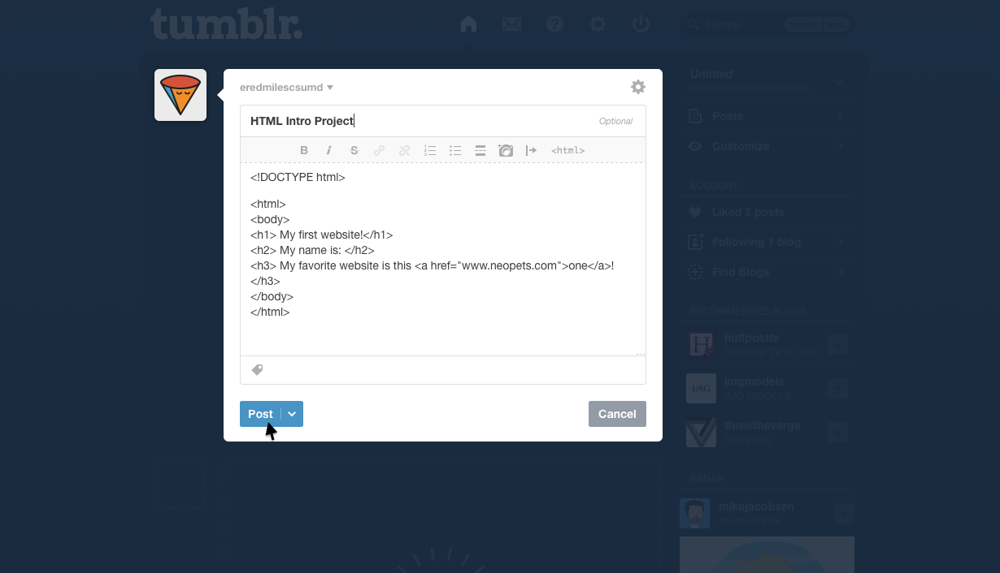
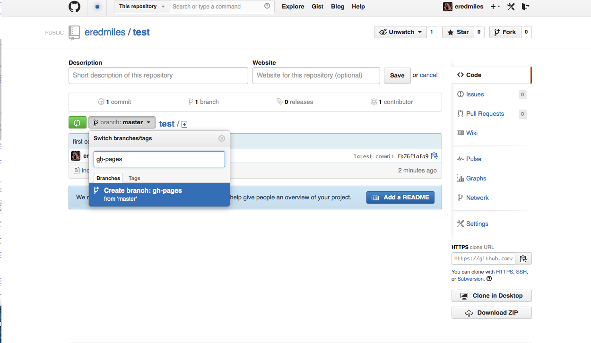
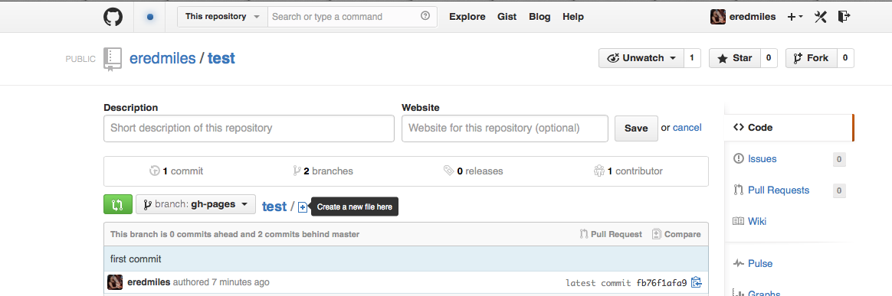
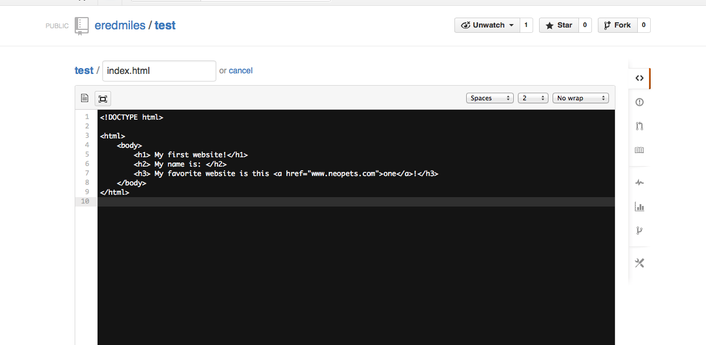

# HTML Files

You can chose to 
1) Paste a copy of your HTML code on your Tumblr page
or
2) Host your HTML code online as a live website and link to both the live website and your code using a GitHub account.

Option 2 will take a bit of work to set up.

---
Option 1 - The Simple Code Pasting Method
<ul>
<li> Navigate to your tumblr blog </li>
<li> Click on Text </li>

<li> Paste your HTML code into the box, and give your code a title. </li> 

</ul>
---
Option 2 - The More Advanced Github Method

You can add a link to your HTML projects on Tumblr.

In order to publish your HTML files that you have on your computer to the internet, you will need to create a GitHub account.

<ul>
<li> Navigate to [www.github.com](www.github.com) and create an account. </li>

<li> Choose the free option. </li> 

<li> Click "Finish sign up"</li>

<li> Click "Set up Git"</li>

<li> Follow the instructions. </li>

<li> Click Create a Repository, and follow the instructions.</li>

<li> Go to your github repository</li>

<li> Click on branch and type gh-pages:</li>

<li> Make sure that you are in the gh-pages branch. Click to create a new file.</li>

<li> Name the file index.html and Paste the code for your website into this file. </li>

<li> Scroll to the bottom and click Commit new file.</li>

<li> Within 10 minutes your file will be displayed at http://[username].github.io/[repository]
Where [username] should be replaced with your username and [repository] should be replaced with the name of your repository. For example, if your username is apple and you named your repository project 1 you would go to http://apple.github.io/project1</li>

<li> You can now paste this link into tumblr just as you did with your scratch projects. You should paste the link to your github repository (which should be github.com/[username]/[repository] e.g. github.com/apple/project1) so that people can see your code!</li>

<li> Phew! Good job. You now have a github account and a github repository. Github is where most professional programmers share their code, and many programming jobs ask for a link to your github profile! </li>
</ul>
---

  

    <a href="../starttumblr"><button type="button" class="btn btn-primary btn-lg">Back</button></a>
  

  

    <a href="../sharingtumblr"><button type="button" class="btn btn-primary btn-lg">Next</button></a>
  

---