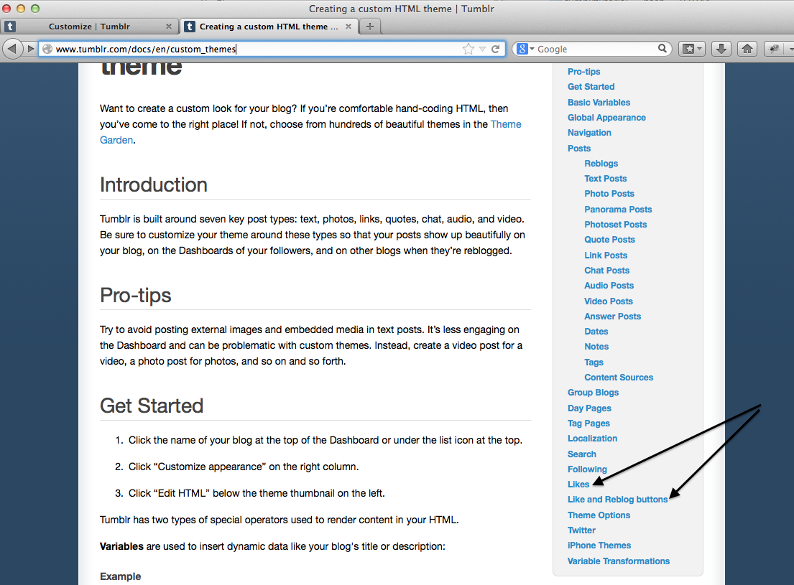

# Adding a Like Button & Learning to Use Tumblr Documentation

When you want to add something to your Tumblr theme layout, you can use the HTML and CSS skills you've already perfected after doing the exercises in our [HTML Building Block Library](http://mcwic.github.io/htmlblocks/htmlBuildingBlocks.html).

You may also want to check out the documentation available from Tumblr [here](http://www.tumblr.com/docs/en/custom_themes). 

For example, if you want to add a section that displays your likes, and you want to add a like button to your posts, you would click on the ["Likes"](http://www.tumblr.com/docs/en/custom_themes#likes) and ["Like and Reblog Buttons"](http://www.tumblr.com/docs/en/custom_themes#like_and_reblog_buttons) sections on the right panel:

You should be able to start by just adding the relevant HTML code for a Likes button and the code to show Likes on your page.

 <a href="../likes_solution"><button type="button" class="btn btn-primary btn-lg">Stuck? Click here for the solution.</button></a>
 

---

  

    <a href="../search"><button type="button" class="btn btn-primary btn-lg">Back</button></a>
  

  

    <a href="../afterward"><button type="button" class="btn btn-primary btn-lg">Next</button></a>
  

---