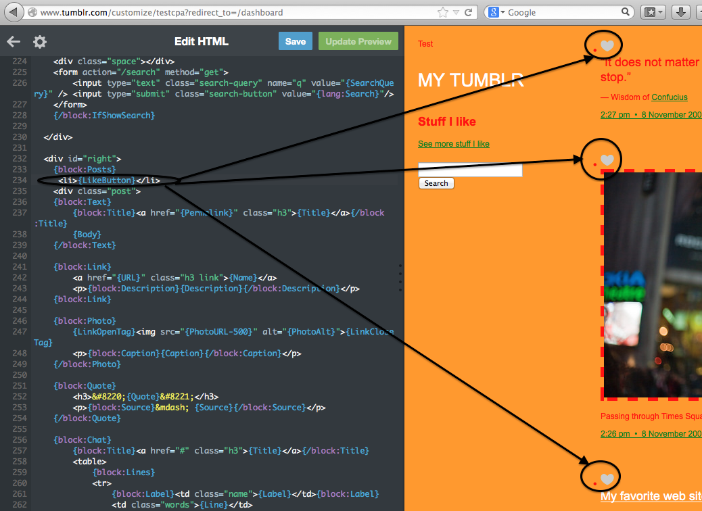

# Adding a Like Button & Learning to Use Tumblr Documentation - Solution

To add a display of your Likes to your Tumblr page, you want to copy and paste the HTML code shown in the [Tumblr documentation](http://www.tumblr.com/docs/en/custom_themes#likes) here. 

<pre><xmp>
      {block:Likes}
            

                <h2>Stuff I like</h2>

                {Likes limit="5" summarize="100" width="150"}

                <a href="http://www.tumblr.com/liked/by/{Name}">
                    See more stuff I like
                </a>
            

        {/block:Likes}
</xmp></pre>

<h2>This is what your Tumblr code will look like after you add the code block above:</h2>

<h2>If you want to change the location of the likes section, just move it down in your code:</h2>

To add like buttons to your posts, you want to use the HTML displayed in the [Tumblr documentation](http://www.tumblr.com/docs/en/custom_themes#like_and_reblog_buttons):

You can use the whole block, or just add this section to the Posts block: <pre><xmp>  <li>{LikeButton}</li> </xmp></pre>

<h2>Your Tumblr code and page will look like this after you add the code block above:</h2>

---

  

    <a href="../likes"><button type="button" class="btn btn-primary btn-lg">Back</button></a>
  

---