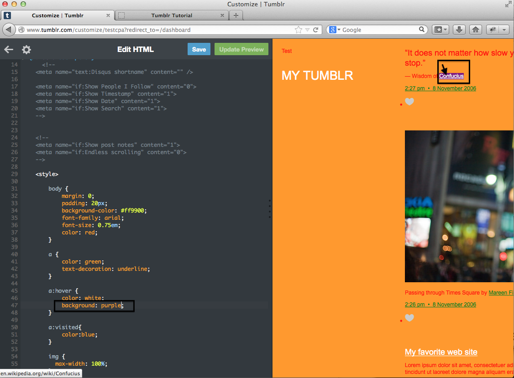

# Changing the Color of Links - Solution

Remember, the code to create a link is <pre><xmp> <a href="[URL HERE]"/> </xmp></pre>
Thus, you're looking in the CSS for the a, a:hover, and a:visited selectors. These are between lines 40 and 52 in the Tumblr html.

  

    

      

        <h3 class="panel-title">Code</h3>
      

      

        <pre><code>
     &lt;style&gt;
      body { 
        margin: 0; 
        padding: 20px;
        <b>background-color: <i>green</i>; </b>
        font-family: arial;
        font-size: 0.75em;
        color: blue;
      }
     <b> a {  //link as you see it on the page
  		  color: black;
			  text-decoration: underline;
		  }
		
	  	a:hover {	//link when the mouse is hovering over it
			  color: white;
			  background: red;
		  }
			
		  a:visited{	//link after it is visited
		    color:blue;
		  }</b>

          </code></pre>
      

    

  
  

You want to change the code in the bold section. You can use the color selector to refer to the text color, see [here](http://mcwic.github.io/htmlblocks/htmlBuildingBlocks.html) and [here](https://www.youtube.com/watch?v=n9HoTInjjUs&index=9&list=PLPpkJJSKXEJ11Mq8xjty3AZKldH9V48mt) for more information on CSS font attributes.

<h2>Here's what your Tumblr code and page will look like before and after your modifications:</h2>

<h3>Before:</h3>
<h4>Link as is:</h4>

<h4>Link when it's hovered over:</h4>

<h3>After:</h3>
<h4>Link as is:</h4>

<h4>Link when it's hovered over:</h4>

---

  

    <a href="../linkcolor"><button type="button" class="btn btn-primary btn-lg">Back</button></a>
  

---