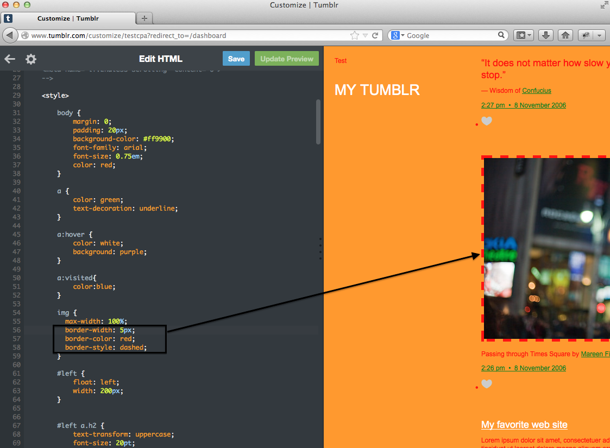

# Changing the Color of Links - Solution

Remember, the code to create a link is <pre><xmp> <a href="[URL HERE]"/> </xmp></pre>
Thus, you're looking in the CSS for the img selector (lines 54 to 56).

  

    

      

        <h3 class="panel-title">Code</h3>
      

      

        <pre><code>
         <b>img{	
		        max-width: 100%;
		     }</b>
          </code></pre>
      

    

  
  

You want to add to the code in the bold section. Lets say we want a dashed border, then we need:
<pre><xmp> border-style: dashed; </pre></xmp>

We can also specify the border color and width:
<pre><xmp>
  border-color: red;
  border-width: 5px;
</pre></xmp>

<h2>Putting this all together, this is what your Tumblr code and page will look like before and after your modifications:</h2>

<h3>Before:</h3>

<h3>After:</h3>

---

  

    <a href="../imageborder"><button type="button" class="btn btn-primary btn-lg">Back</button></a>
  

---