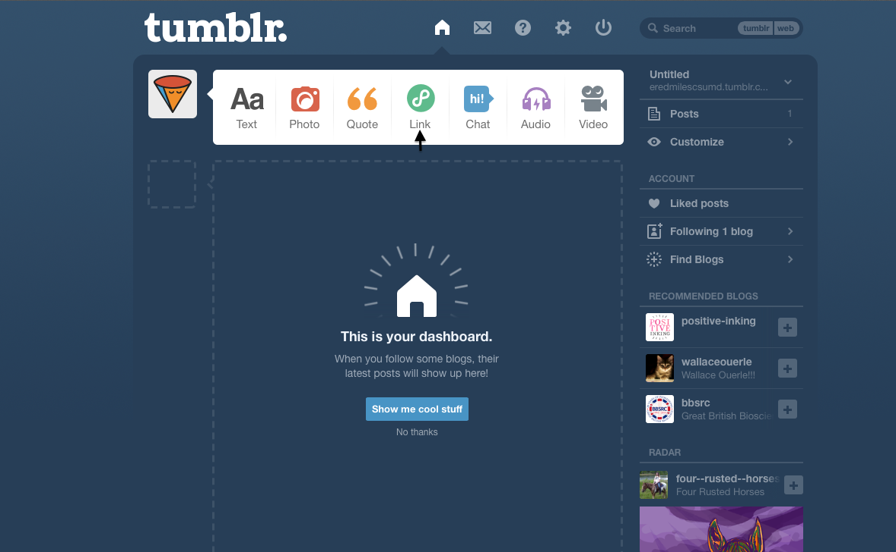
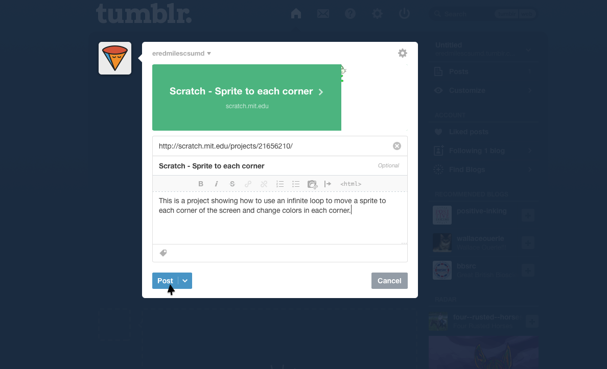

# Linking to Scratch Files

You can add a link to your Scratch projects in Tumblr. 

To do so follow the following steps:
<ul> 
<li>Click on "Link" </li>

  
<li> Paste the URL of your Scratch project into the URL box on Tumblr </li>
  
<li> Describe your Scratch Project </li>

  
<li>Click Post</li>

---

  

    <a href="../starttumblr"><button type="button" class="btn btn-primary btn-lg">Back</button></a>
  

  

    <a href="../htmltumblr"><button type="button" class="btn btn-primary btn-lg">Next</button></a>
  

---