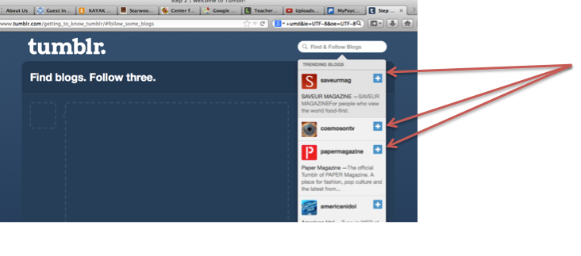
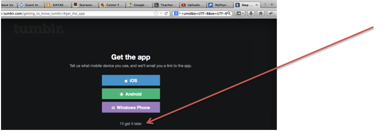
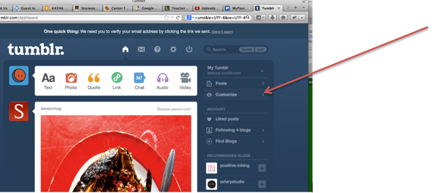

# Setting Up Your Tumblr Blog

<ul>
<li> Follow at least three blogs.</li>

<li> Reblog at least three posts.</li>

<li> When asked about getting the Tumblr app, select "I'll get it later"</li>

<li> Click "Customize" on the right panel.</li>

---

  

    <a href="../start"><button type="button" class="btn btn-primary btn-lg">Back</button></a>
  

  

    <a href="../theme"><button type="button" class="btn btn-primary btn-lg">Next</button></a>
  

---