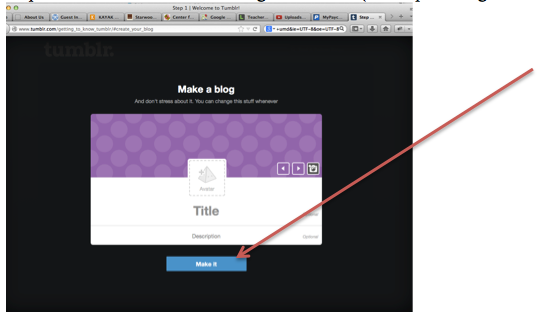

# Creating a Tumblr Account

1. Navigate to tumblr.com

2. Fill out the required information (email address)

3. Navigate to your email and open the email from Tumblr. 

4. Confirm your email address.

5. Type in the required information to "Create Your Blog":

---

<a href="../setup"><button type="button" class="btn btn-primary btn-lg">Next</button></a>

---