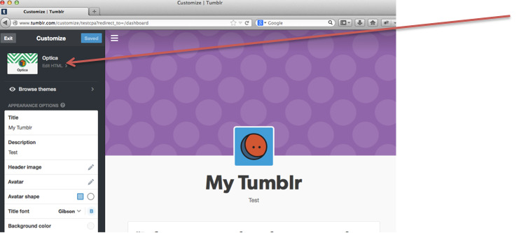
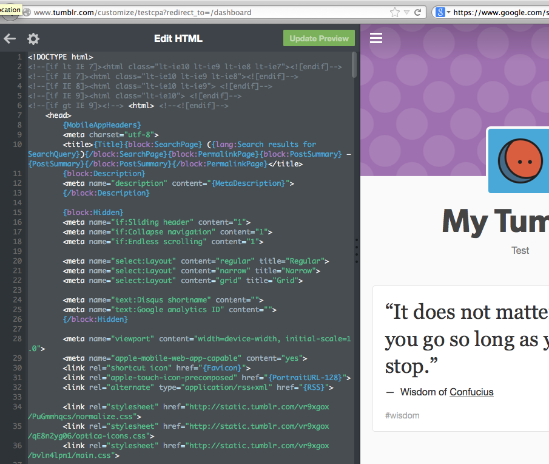
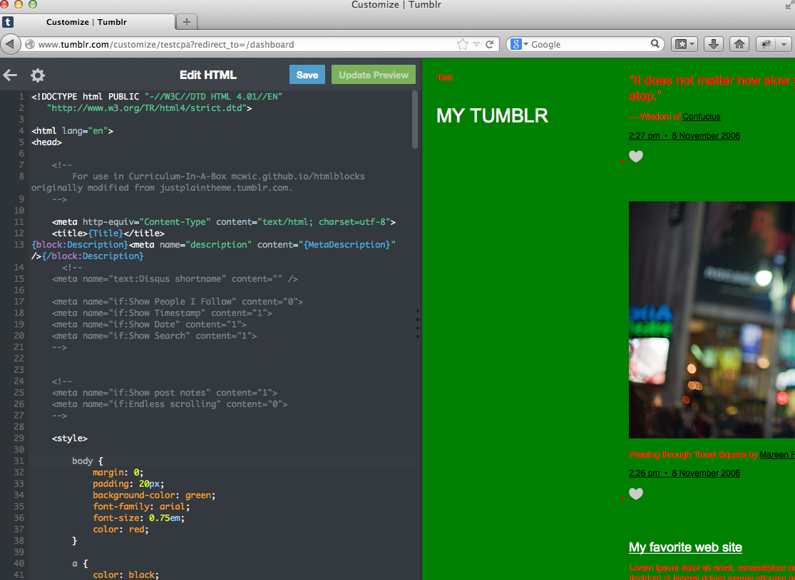

# Adding the Theme Template

<ul>
<li> Click "Edit HTML" </li>

  
<li> Copy all of the HTML from mcwic.github.io/htmlblocks/tumblrTheme.html </li>
  
<li> Replace the code on the Tumblr page with the code from [here](mcwic.github.io/htmlblocks/tumblrTheme.html) </li>
</ul>

<h3>Before:</h3>

<h3>After:</h3>

---

  

    <a href="../setup"><button type="button" class="btn btn-primary btn-lg">Back</button></a>
  

  

    <a href="../backgroundcolor"><button type="button" class="btn btn-primary btn-lg">Next</button></a>
  

---